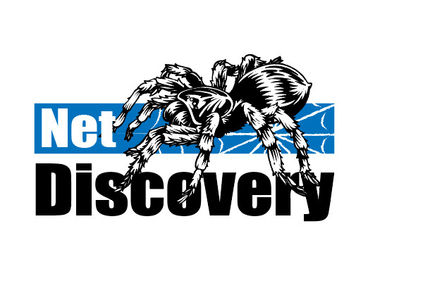

# NetDiscovery

[](http://www.weibo.com/fengzhizi715)
[](https://www.apache.org/licenses/LICENSE-2.0.html)
[](https://app.codacy.com/app/fengzhizi715/NetDiscovery?utm_source=github.com&utm_medium=referral&utm_content=fengzhizi715/NetDiscovery&utm_campaign=Badge_Grade_Dashboard)


# 功能特点：

* 轻量级爬虫
* 模块化设计，便于扩展：支持多种消息队列(Disruptor、Redis、Kafka、RabitMQ、RocketMQ)、多种网络框架(Http Client、Okhttp3、Selenium等)，也支持自己实现。
* 支持分布式
* 多线程、异步化：底层使用 RxJava 2 的多线程机制
* 支持线程池隔离：爬虫的 Parser、Pipeline 过程可以放在独立的线程池中进行处理
* 支持 Request 动态添加到正在运行爬虫的 Queue 中
* 支持 Kotlin 协程
* 支持 JS 渲染
* 支持 Request 自定义 header 信息
* 支持 debug 功能：在调试时 Request 可以打开 debug 的开关，使用 Local Cache(RxCache) 存储请求的结果，从而避免多次请求同一个网页。
* 支持失败重试的机制
* 多纬度控制爬取速度（Pipeline、Request、Download、Domain）等等
* 支持代理池、User Agent 池、Cookies 池
* 支持爬虫的深度抓取：能够在 Pipeline 中发起深度抓取
* 支持 URL 去重：使用布隆过滤器
* 支持 Spider 的监控、SpiderEngine 的监控 (基于Etcd、Zookeeper)
* agent 模块能够对当前服务器的 CPU 和内存进行实时监控
* SpiderEngine 整合 Quartz
* SpiderEngine 提供 http、RPC 接口


# 最新版本

模块名|最新版本|
---|:-------------:
netdiscovery-core-core|[  ](https://bintray.com/fengzhizi715/maven/netdiscovery-core-core/_latestVersion)
netdiscovery-core-engine|[  ](https://bintray.com/fengzhizi715/maven/netdiscovery-core-engine/_latestVersion)
netdiscovery-core-engine-monitor|[  ](https://bintray.com/fengzhizi715/maven/netdiscovery-core-engine-monitor/_latestVersion)
netdiscovery-downloader-htmlunit|[  ](https://bintray.com/fengzhizi715/maven/netdiscovery-downloader-htmlunit/_latestVersion)
netdiscovery-downloader-httpclient|[  ](https://bintray.com/fengzhizi715/maven/netdiscovery-downloader-httpclient/_latestVersion)
netdiscovery-downloader-okhttp|[  ](https://bintray.com/fengzhizi715/maven/netdiscovery-downloader-okhttp/_latestVersion)
netdiscovery-downloader-selenium|[  ](https://bintray.com/fengzhizi715/maven/netdiscovery-downloader-selenium/_latestVersion)
netdiscovery-pipeline-couchbase|[  ](https://bintray.com/fengzhizi715/maven/netdiscovery-pipeline-couchbase/_latestVersion)
netdiscovery-pipeline-elasticsearch|[  ](https://bintray.com/fengzhizi715/maven/netdiscovery-pipeline-elasticsearch/_latestVersion)
netdiscovery-pipeline-mongo|[  ](https://bintray.com/fengzhizi715/maven/netdiscovery-pipeline-mongo/_latestVersion)
netdiscovery-pipeline-redis|[  ](https://bintray.com/fengzhizi715/maven/netdiscovery-pipeline-redis/_latestVersion)
netdiscovery-queue-kafka|[  ](https://bintray.com/fengzhizi715/maven/netdiscovery-queue-kafka/_latestVersion)
netdiscovery-queue-rabbitmq|[  ](https://bintray.com/fengzhizi715/maven/netdiscovery-queue-rabbitmq/_latestVersion)
netdiscovery-queue-redis|[  ](https://bintray.com/fengzhizi715/maven/netdiscovery-queue-redis/_latestVersion)
netdiscovery-queue-rocketmq|[  ](https://bintray.com/fengzhizi715/maven/netdiscovery-queue-rocketmq/_latestVersion)
netdiscovery-kotlin-coroutines|[  ](https://bintray.com/fengzhizi715/maven/netdiscovery-kotlin-coroutines/_latestVersion)
netdiscovery-kotlin-dsl|[  ](https://bintray.com/fengzhizi715/maven/netdiscovery-kotlin-coroutines/_latestVersion)

NetDiscovery 是基于 Vert.x、RxJava 2 等框架实现的爬虫框架。目前仍在不断地完善中，期望能成为通用的爬虫框架。

对于 Java 工程，如果使用 gradle 构建，由于默认没有使用 jcenter()，需要在相应 module 的 build.gradle 中配置

## Gradle

```groovy
repositories {
    jcenter()
}
```

## Maven

```xml
<repositories>
    <repository>
        <id>central</id>
        <name>bintray</name>
        <url>https://jcenter.bintray.com</url>
    </repository>
</repositories>
```

在 NetDiscovery 中，Spider 可以单独运行，Spider 也可以交给 SpiderEngine 来控制。

SpiderEngine 可以在运行之前注册到 Etcd/Zookeeper，然后由 monitor 对 SpiderEngine 进行监控。


# Stargazers over time

[](https://starchart.cc/fengzhizi715/NetDiscovery)


# 详细功能查看[wiki](https://github.com/fengzhizi715/NetDiscovery/wiki)

# [下载](https://github.com/fengzhizi715/NetDiscovery/blob/master/Download.md)

# 案例:

* [user-agent-list](https://github.com/fengzhizi715/user-agent-list):抓取常用浏览器的user agent
* [FXHParser](https://github.com/fengzhizi715/FXHParser):抓取非小号数字货币

# 基于本人的开源项目

* [RxCache](https://github.com/fengzhizi715/RxCache)
* [ProxyPool](https://github.com/fengzhizi715/ProxyPool)


# TODO List:

* Kotlin 版本增加 Kotlin-Cli
* 整合 OpenCV 以及 Tesseract，实现 OCR 识别的功能
* 增加 admin 模块
* 支持 Consul
* 增强 HtmlUnit 模块
* 增加 chromium 的支持
* 完善 wiki，增加各个模式的使用说明
* 支持 RxJava 3.x 
* 支持 Java 11
* 支持 docker


# Contributors:

* [bdqfork](https://github.com/bdqfork)
* [homchou](https://github.com/homchou)
* [sinkinka](https://github.com/sinkinka)


# Contributing:

[Pull requests](https://help.github.com/categories/collaborating-with-issues-and-pull-requests/) are welcome


# 联系方式:

Wechat：fengzhizi715

> Java与Android技术栈：每周更新推送原创技术文章，欢迎扫描下方的公众号二维码并关注，期待与您的共同成长和进步。


License
-------

    Copyright (C) 2017 - present, Tony Shen.

    Licensed under the Apache License, Version 2.0 (the "License");
    you may not use this file except in compliance with the License.
    You may obtain a copy of the License at

       http://www.apache.org/licenses/LICENSE-2.0

    Unless required by applicable law or agreed to in writing, software
    distributed under the License is distributed on an "AS IS" BASIS,
    WITHOUT WARRANTIES OR CONDITIONS OF ANY KIND, either express or implied.
    See the License for the specific language governing permissions and
    limitations under the License.


