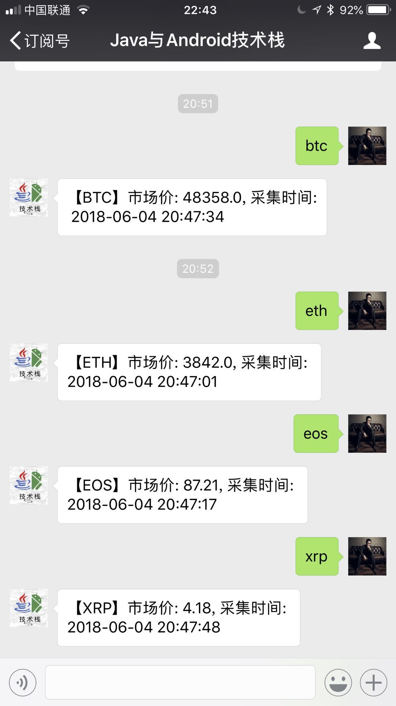

# NetDiscovery

[](http://www.weibo.com/fengzhizi715)
[](https://www.apache.org/licenses/LICENSE-2.0.html)

# 最新版本

模块|netdiscovery-core|netdiscovery-extra|netdiscovery-selenium|netdiscovery-dsl
---|:-------------:|:-------------:|:-------------:|:-------------:
最新版本| [  ](https://bintray.com/fengzhizi715/maven/netdiscovery-core/_latestVersion)| [  ](https://bintray.com/fengzhizi715/maven/netdiscovery-extra/_latestVersion)|[  ](https://bintray.com/fengzhizi715/maven/netdiscovery-selenium/_latestVersion)| [  ](https://bintray.com/fengzhizi715/maven/netdiscovery-dsl/_latestVersion)

NetDiscovery目前还是早期的版本，很多的细节正在不断地完善中。

# NetDiscovery 功能点：
## 1.Spider功能
Spider可以单独使用，也可以添加到SpiderEngine中使用。

Spider中内置了很多组件。例如downloader就已经支持了好几种，支持热插拔随时替换，或者编写自己的downloader。

queue、parser、pipeline也都类似。其中，支持多个pipeline按照顺序执行。


在调试的时候，可以使用ConsolePipeline或者DebugPipeline

DebugPipeline打印的日志效果如下


## 2.SpiderEngine功能
SpiderEngine可以管理引擎中的爬虫，包括爬虫的生命周期。


### 2.1 获取某个爬虫的状态
http://localhost:{port}/netdiscovery/spider/{spiderName}

类型：GET

### 2.2 获取SpiderEngine中所有爬虫的状态
http://localhost:{port}/netdiscovery/spiders/

类型：GET

### 2.3 修改某个爬虫的状态
http://localhost:{port}/netdiscovery/spider/{spiderName}/status

类型：POST

参数说明：

```java
{
    "status":2   //让爬虫暂停
}
```

|status       | 作用        |
|:-------------|:-------------|
|2|让爬虫暂停|
|3|让爬虫从暂停中恢复|
|4|让爬虫停止|

## 3. admin模块功能

[admin模块功能](admin.md)

# NetDiscovery 基本原理：
## 1.基本原理


## 2.集群原理


# 案例:
* [user-agent-list](https://github.com/fengzhizi715/user-agent-list):抓取常用浏览器的user agent
* 在“Java与Android技术栈”公众号回复数字货币的关键字，获取最新的价格


# TODO:
1. 整合[cv4j](https://github.com/imageprocessor/cv4j)以及Tesseract，实现OCR识别的功能
2. 增加elasticsearch的支持

# 联系方式:
QQ交流群：490882934
