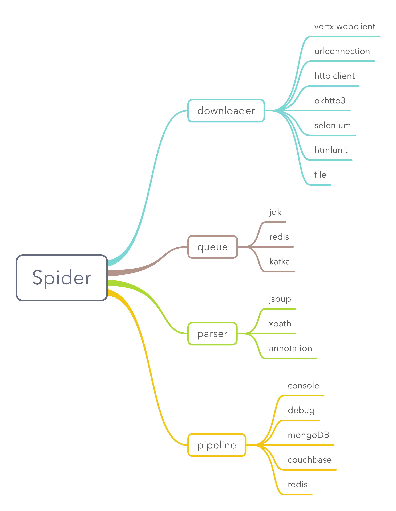
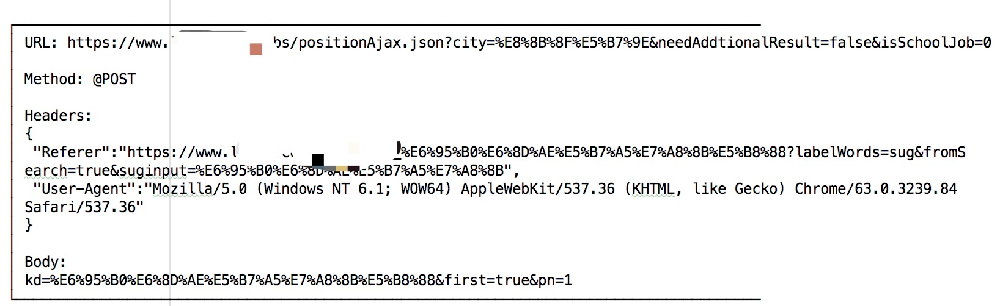
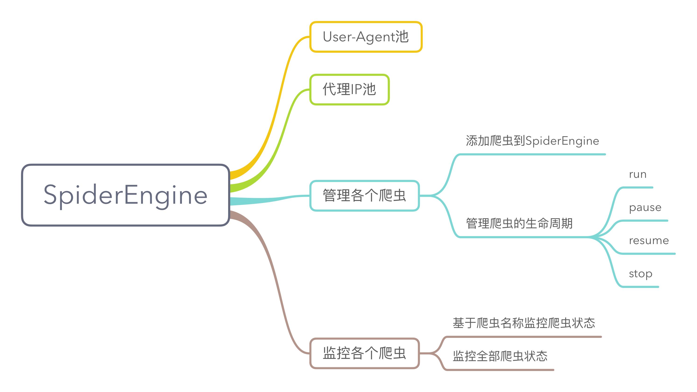
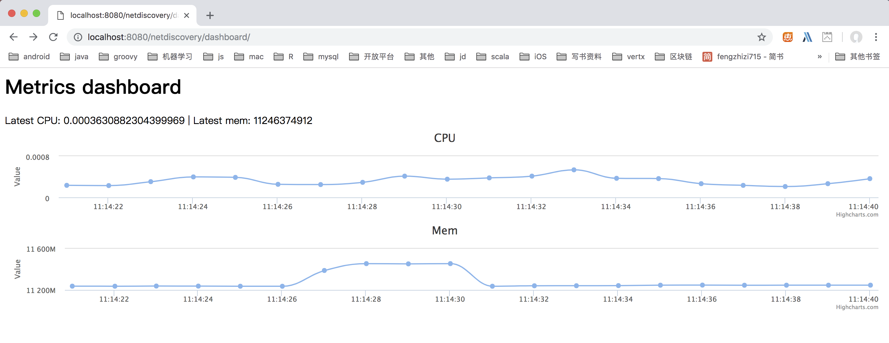
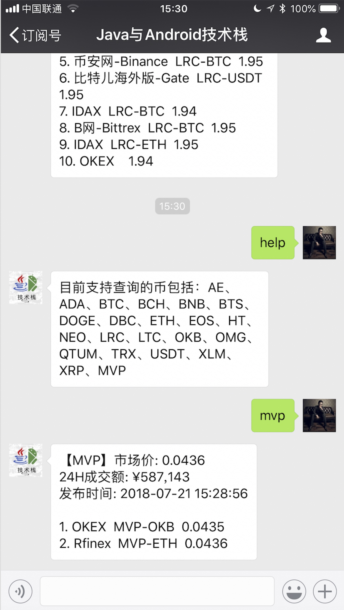
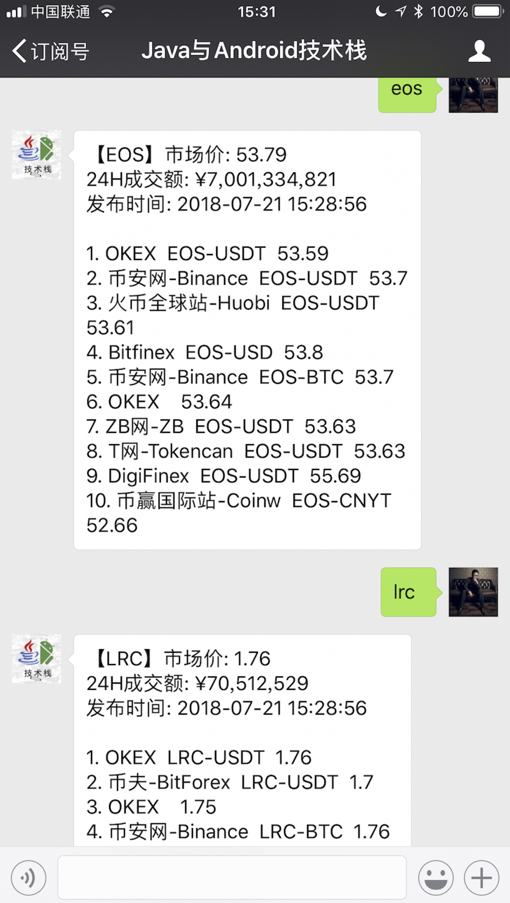

# NetDiscovery

[](http://www.weibo.com/fengzhizi715)
[](https://www.apache.org/licenses/LICENSE-2.0.html)

# 最新版本

模块名|最新版本|
---|:-------------:
netdiscovery-core|[  ](https://bintray.com/fengzhizi715/maven/netdiscovery-core/_latestVersion)
netdiscovery-extra|[  ](https://bintray.com/fengzhizi715/maven/netdiscovery-extra/_latestVersion)
netdiscovery-selenium|[  ](https://bintray.com/fengzhizi715/maven/netdiscovery-selenium/_latestVersion)
netdiscovery-dsl|[  ](https://bintray.com/fengzhizi715/maven/netdiscovery-dsl/_latestVersion)
netdiscovery-coroutines| [  ](https://bintray.com/fengzhizi715/maven/netdiscovery-coroutines/_latestVersion)


NetDiscover 是基于 Vert.x、RxJava 2 等框架实现的爬虫框架。目前还处于早期版本，很多细节正在不断地完善中。

对于 Java 工程，如果使用 gradle 构建，由于默认没有使用 jcenter()，需要在相应 module 的 build.gradle 中配置

```groovy
repositories {
    mavenCentral()
    jcenter()
}
```


# 下载:

netdiscovery-core

```groovy
implementation 'com.cv4j.netdiscovery:netdiscovery-core:0.2.10'

```

netdiscovery-extra

```groovy
implementation 'com.cv4j.netdiscovery:netdiscovery-extra:0.2.10'
```

netdiscovery-selenium

```groovy
implementation 'com.cv4j.netdiscovery:netdiscovery-selenium:0.2.10'
```

netdiscovery-dsl

```groovy
implementation 'com.cv4j.netdiscovery:netdiscovery-dsl:0.0.10'
```

netdiscovery-coroutines

```groovy
implementation 'com.cv4j.netdiscovery:netdiscovery-coroutines:0.0.10'
```

# NetDiscovery 功能点：

## 1.Spider功能
Spider 可以单独使用，也可以添加到 SpiderEngine 中使用。

Spider 中内置了很多组件。例如 downloader 就已经支持了多种，支持热插拔随时替换或者编写自己的 downloader。

queue、parser、pipeline 也都类似。其中，多个 pipeline 会按照顺序执行。



在调试的时候，可以使用 ConsolePipeline 或者 DebugPipeline

DebugPipeline打印的日志效果如下:




## 2.SpiderEngine功能
SpiderEngine 可以管理引擎中的爬虫，包括爬虫的生命周期。


还可以对当前服务器的CPU和内存进行实时监控



### 2.1 获取某个爬虫的状态
http://localhost:{port}/netdiscovery/spider/{spiderName}

类型：GET

### 2.2 获取SpiderEngine中所有爬虫的状态
http://localhost:{port}/netdiscovery/spiders/

类型：GET

### 2.3 修改某个爬虫的状态
http://localhost:{port}/netdiscovery/spider/{spiderName}/status

类型：POST

参数说明：

```java
{
    "status":2   //让爬虫暂停
}
```

|status       | 作用        |
|:-------------|:-------------|
|2|让爬虫暂停|
|3|让爬虫从暂停中恢复|
|4|让爬虫停止|


## 3. DSL 模块

使用 DSL 来创建一个爬虫并运行:

```kotlin
        val spider = spider {

            name = "tony"

            urls = listOf("http://www.163.com/","https://www.baidu.com/")

            pipelines = setOf(ConsolePipeline())
        }

        spider.run()
```

它等价于下面的java代码

```java
        Spider.create().name("tony1")
                .url("http://www.163.com/", "https://www.baidu.com/")
                .pipeline(new ConsolePipeline())
                .run();
```

还可以使用 DSL 来创建 SpiderEngine：

```kotlin
        val spiderEngine = spiderEngine {

            port = 7070

            addSpider {

                name = "tony1"
            }

            addSpider {

                name = "tony2"
                urls = listOf("https://www.baidu.com")
            }
        }

        val spider = spiderEngine.getSpider("tony1")

        spider.repeatRequest(10000,"https://github.com/fengzhizi715")
                .initialDelay(10000)

        spiderEngine.runWithRepeat()
```


# NetDiscovery 基本原理：
## 1.基本原理


## 2.集群原理


# 案例:
* [user-agent-list](https://github.com/fengzhizi715/user-agent-list):抓取常用浏览器的user agent
* 在“Java与Android技术栈”公众号回复数字货币的关键字，获取最新的价格





# TODO List:

1. 增加 Cooikes Pool
2. 使用 lettuce 替换现在使用的 redis 的库
3. 增加 elasticsearch 的支持
4. 增加 RabbitMQ 的支持
5. 增强 HtmlUnit 模块
6. 整合[cv4j](https://github.com/imageprocessor/cv4j)以及 Tesseract，实现 OCR 识别的功能

# Contributors：
* [bdqfork](https://github.com/bdqfork)
* [sinkinka](https://github.com/InsertKoinIO/koin)

# 联系方式:

QQ交流群：490882934

> Java与Android技术栈：每周更新推送原创技术文章，欢迎扫描下方的公众号二维码并关注，期待与您的共同成长和进步。


License
-------

    Copyright (C) 2017 Tony Shen.

    Licensed under the Apache License, Version 2.0 (the "License");
    you may not use this file except in compliance with the License.
    You may obtain a copy of the License at

       http://www.apache.org/licenses/LICENSE-2.0

    Unless required by applicable law or agreed to in writing, software
    distributed under the License is distributed on an "AS IS" BASIS,
    WITHOUT WARRANTIES OR CONDITIONS OF ANY KIND, either express or implied.
    See the License for the specific language governing permissions and
    limitations under the License.


